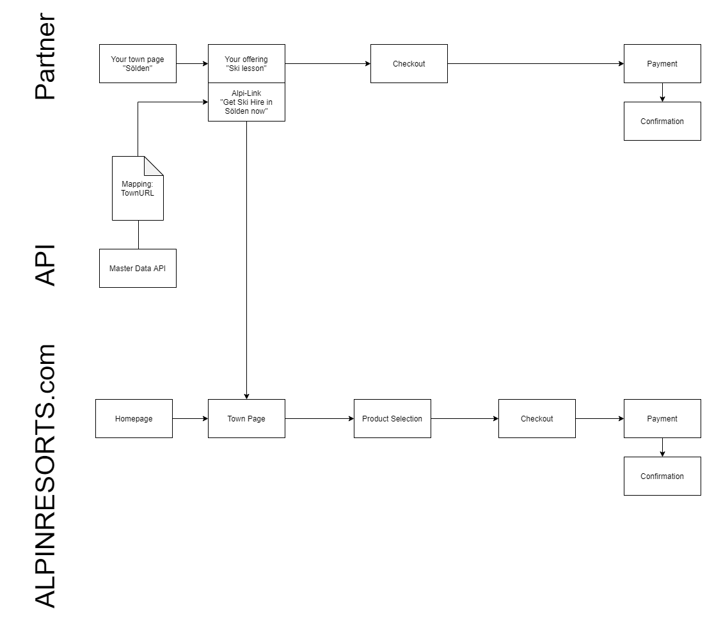
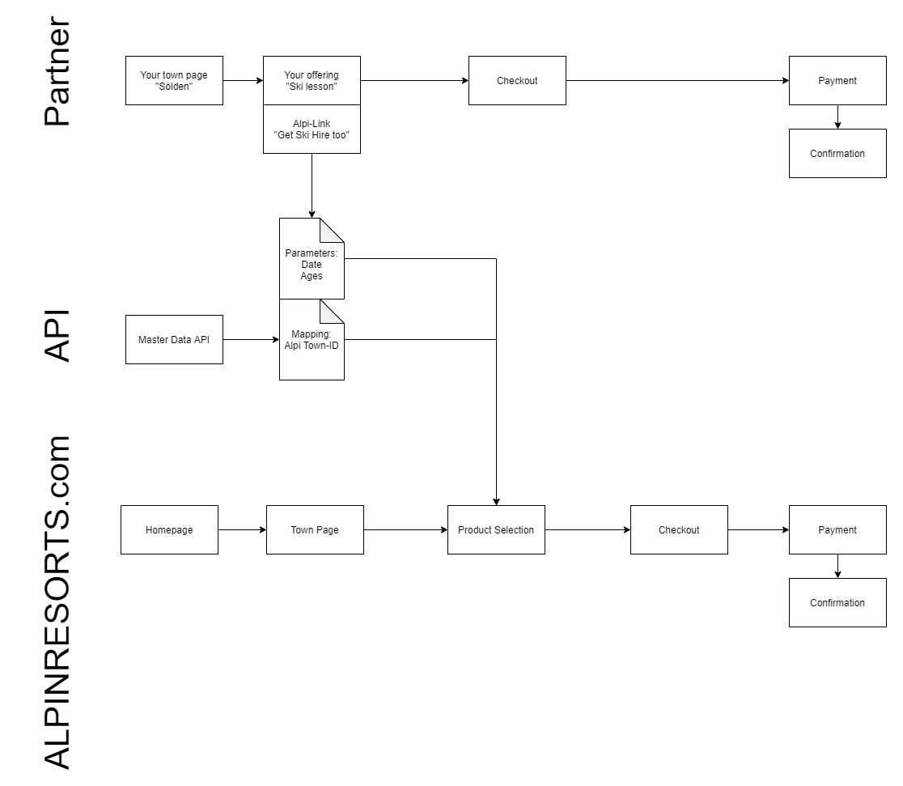
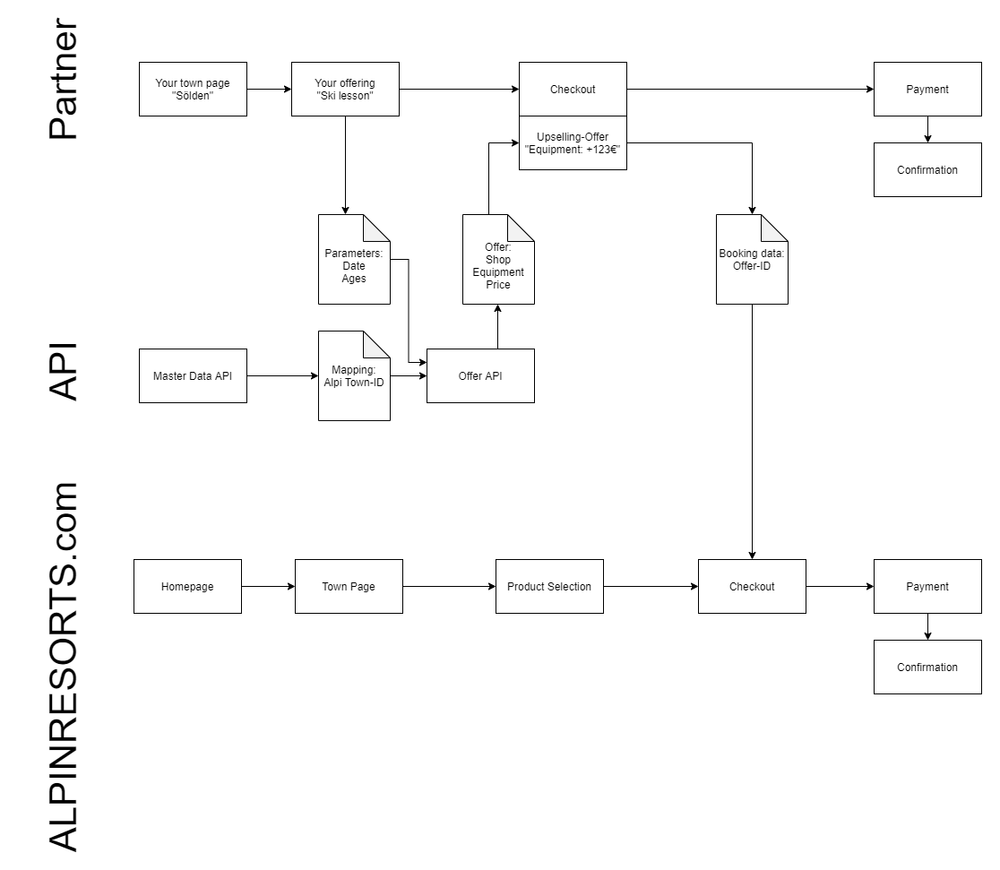
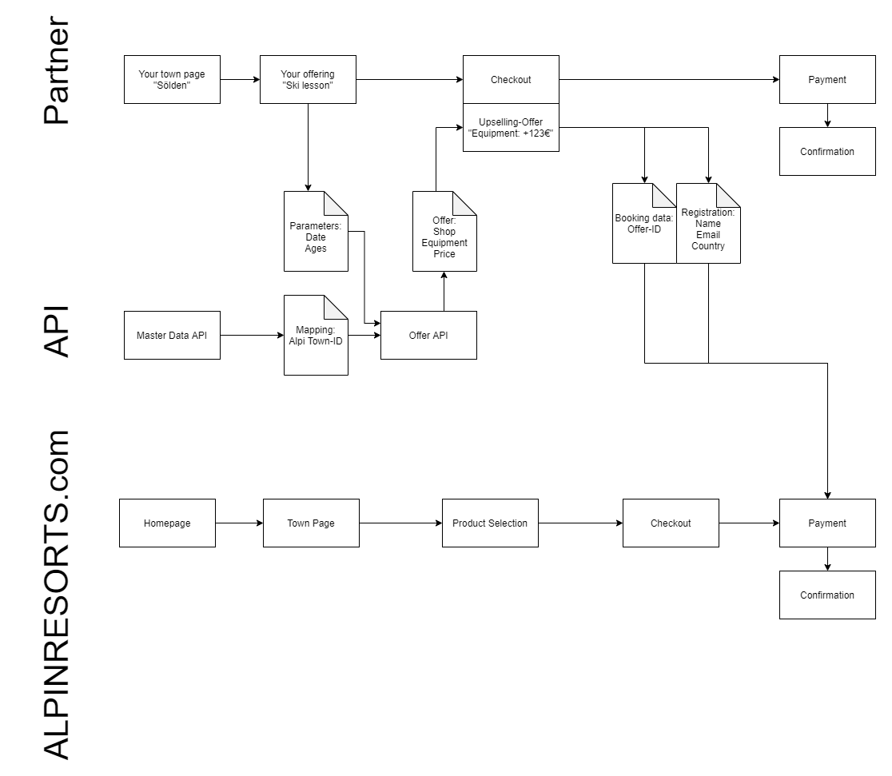
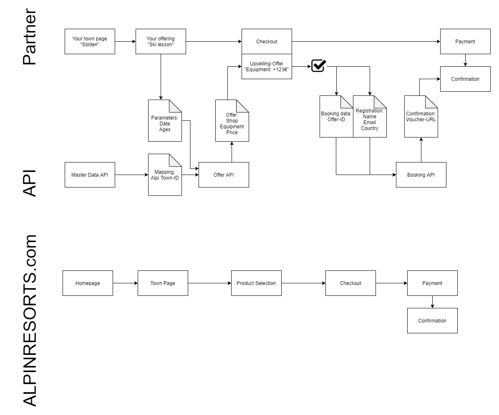

# Implementation scenarios

This section is intended to give a graphical overview of the various integration approaches for the ALPINRESORTS.com API. 

## Referer Partnership

The easiest way to integrate the API is to download the master data from the [Master Data API](../master-data-api/README.md)
and create a mapping between the partner's town structure and the URLs of ALPINRESORTS.com. This way, the partner can
link to ALPINRESORTS.com and the customer can complete a booking through the ALPINRESORTS.com website.

If you want to create links to ALPINRESORTS.com as part of a link partnership with referer tracking, you can choose
one of the approaches outlined in this section.

### Create links to landing pages for towns
 
The URLs to the town pages can be found in the master data. If you link directly to such a URL, the `Referer` header of
the customer's browser will indicate the referral to the ALPINRESORTS.com website, and is tracked properly. If, for some
reason, customers might arrive with no `Referer`-header in the partner's use case, a `?referer=[domain]` GET-parameter 
can be appended to the URL. Please ensure that the partner's `[domain]` is also registered in the ALPINRESORTS.com 
partner system.

### Create links to shop pages

The URLs to the shops' "parameter" page are found in the master data. On that page, the client can enter 
the specifics of their booking and proceed to the shop's products and prices. For referer tracking, the same options 
apply as for the town-level URLs stated above.

### Create a deeplink into the product selection 

If the partner intends to collect some basic metadata of the customer's booking intention, a deeplink straight into the
booking engine of ALPINRESORTS.com can be generated. 

The URL to use for this link is

`https://www.alpinresorts.com/de/skiverleih/products` 

with the following GET-parameters:

Name | Type | Description | Notes
------------ | ------------- | ------------- | -------------
**shopId** | **int** | The ID of the shop in the ALPINRESORTS.com database, as retrieved from the master data API. |
**startDate** | **string** | First day of booking consumation. Format: YYYY-MM-DD | 
**endDate** | **string** | Last day of booking consumation. Format: YYYY-MM-DD | 
**personAges** | **int[]** | An array[] of integers indicating the age of every participant at the first day of consumation. | [optional] 
**referer** | **string** | The domain where the referral originated from. An alternative to relying on the `Referer`-header of the client's browser. | [optional] 

An example URL would be
`https://www.alpinresorts.com/de/skiverleih/products?referer=yoursite.com&shopId=748&startDate=2020-12-09&endDate=2020-12-15&personAges[]=36&personAges[]=11` 

## Get offers and prices for a customer's specific set of booking parameters

If the partner can provide some details of your customer's travel intentions, a specific offer for these booking parameters
can be obtained through the [Offer-API](../offer-api/README.md).

- Authenticate through the [Auth-API](../offer-api/docs/Api/AuthApi.md).
- Make a request to the [Town-API](../offer-api/docs/Api/RequestTownApi.md) or the [Shop-API](../offer-api/docs/Api/RequestShopApi.md)
  to get an [Offer](../offer-api/docs/Model/Offer.md).
- You can then present the offer to the customer and allow them to proceed to the ALPINRESORTS.com booking engine in one 
  of the ways described in this described in this section. 

### Deeplink to checkout page

If the partner obtained an offer, you can direct the customer to the ALPINRESORTS.com checkout page to complete registration there.

To do this, set a link to `https://www.alpinresorts.com/de/payment/checkout` with the following GET parameter:

Name | Type | Description | Notes
------------ | ------------- | ------------- | -------------
**offerUUID** | **string** | UUID of the offer |

### Deeplink to payment page

If the partner obtained an offer and registration should be completed on the partner's website, the customer can be 
directed straight to the ALPINRESORTS.com payment step.

To do this, set a link to `https://www.alpinresorts.com/de/payment/checkout` with the following GET parameters:

Name | Type | Description | Notes
------------ | ------------- | ------------- | -------------
**offerUUID** | **string** | UUID of the offer |
**email** | **string** | The e-mail address of the customer | 
**name** | **string** | The full name of the customer |
**countryCode** | **string** | ISO 3166-1 Alpha-2 country code of the customer's residence |
**phoneNumber** | **string** | Telephone number of the customer, including leading dialing code (e.g. "+44123454"). | [optional]

### Use Case: Make a booking for an offer

If the partner provides their own checkout process, the booking can be made on behalf of your customer through
the [Offer-API](../offer-api/README.md).
 

It requires performing these steps:

- Retrieve an offer for the customer's booking parameters, as described above.
- Make a request to the [Booking-API](../offer-api/docs/Api/BookingApi.md), including the offer reference and the booking customer's details.
- Retrieve the booking metadata from the resulting status link and inform your customer about the booking details.
